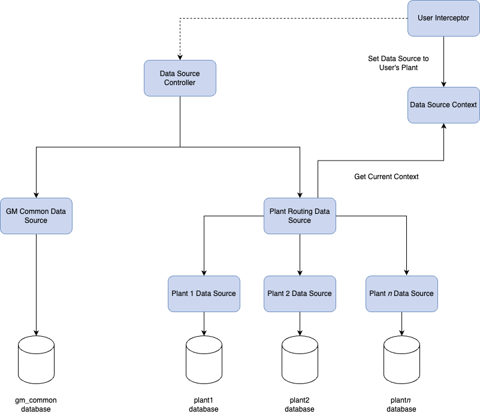

# Spring JPA Data Source Demo
## Introduction
This application demonstrates how to use multiple data sources in Spring JPA. In this application there are multiple data sources for databases that represent a user's assigned plant. The data source is dynamically targeted based on the user's plant assignment. The user/plant assignment is stored in a separate shared database.

## Design

## Running
 1. Ensure you have the proper databases created. They can be named anything (by default they're plant1, plant2, etc.).
 1. Create the common database.
 1. Update the datasource configurations for all of the databases. This can be done in [application.properties](src/main/resources/application.properties), or you can override them as environment variables.
 1. Run the application (`mvn clean package spring-boot:run`). The table and sample data will be created in the plant databases on startup.
 1. Navigate to the [home page](http://localhost:8080). 